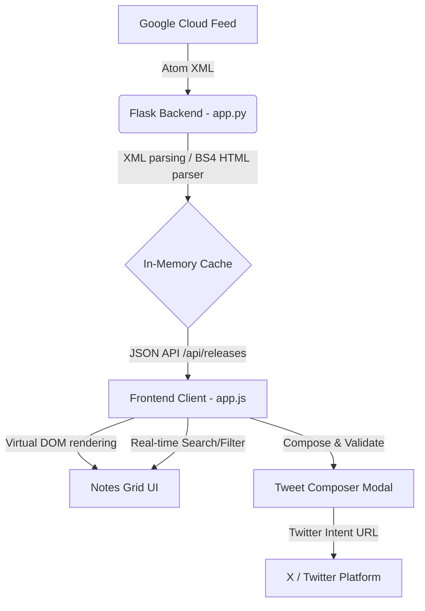

# BigQuery Release Notes Explorer 🚀

[](https://python.org)
[](https://flask.palletsprojects.com/)
[](https://developer.mozilla.org/)
[](https://developer.mozilla.org/)
[](https://opensource.org/licenses/MIT)

A beautiful, premium web application built using **Python Flask** and **plain vanilla HTML, CSS, and JavaScript** that fetches, parses, and formats the Google Cloud BigQuery Release Notes feed. It includes filtering, keyword searching, cache management, and a custom tweet composer.

---

## 🌟 Key Features

*   **Smart Parsing Backend**: Connects to the official Google Cloud BigQuery RSS/Atom feed and parses the aggregated daily release entries into individual, isolated updates categorized as **Features**, **Fixes**, **Issues**, or **Deprecations**.
*   **Premium Visual Experience**: Designed with a sleek, dark-slate aesthetic using modern typography (Outfit and Inter), smooth linear gradients, glassmorphism card layouts, custom scrollbars, and micro-animations.
*   **Live Metrics Dashboard**: Visual badges representing total update counts dynamically computed across all categories.
*   **Real-time Search & Filters**: Search titles, types, and descriptions instantly. Filter updates by category with a single click.
*   **Performance Optimization**: Includes an in-memory caching mechanism (5-minute TTL) to minimize server roundtrips to Google, backed by a refresh button with a loading spinner for on-demand sync.
*   **Custom Tweet Composer**: A customized sharing interface that automatically strips HTML tags, formats the tweet cleanly, tracks character count limits dynamically (accounting for Twitter's 23-character URL format), and loads the official Twitter/X Web Intent.

---

## 🏗️ Architecture & Data Flow



### 1. The Backend ([app.py](file:///C:/Users/tpricop/OneDrive%20-%20Microsoft/Desktop/KaggleXGoogle/agy-cli-projects/bq-releases-notes/app.py))
- Fetches the Atom feed from `https://docs.cloud.google.com/feeds/bigquery-release-notes.xml`.
- Uses Python's standard `xml.etree.ElementTree` to parse the Atom entries.
- Employs **BeautifulSoup 4** to step through the HTML body of each day's entry and split it by `<h3>` headers into individual structured update objects.
- Caches the parsed list in memory for `300` seconds to guarantee optimal speed and rate-limiting safety.

### 2. The Styling System ([static/css/styles.css](file:///C:/Users/tpricop/OneDrive%20-%20Microsoft/Desktop/KaggleXGoogle/agy-cli-projects/bq-releases-notes/static/css/styles.css))
- Features custom CSS properties (`:root`) for color palette definitions, gradients, shadows, border radii, and transition timings.
- Uses responsive Flexbox and Grid layouts to adapt to desktop, tablet, and mobile viewport sizes.
- Integrates linear gradients on buttons, dynamic borders on category cards, and keyframe animations for loading indicators.

### 3. The Logic Controller ([static/js/app.js](file:///C:/Users/tpricop/OneDrive%20-%20Microsoft/Desktop/KaggleXGoogle/agy-cli-projects/bq-releases-notes/static/js/app.js))
- Handles asynchronous API requests to the Flask server.
- Performs client-side keyword matches and category filters.
- Tracks character validation constraints (maximum 256 characters of text, leaving 24 characters for the URL and trailing spaces).

---

## 📁 File Structure

```text
bq-releases-notes/
├── app.py              # Flask server & XML parsing engine
├── run.bat             # Startup batch script shortcut for Windows
├── README.md           # Documentation
├── .gitignore          # Ignored local venv and caches
├── templates/
│   └── index.html      # UI page structure
└── static/
    ├── css/
    │   └── styles.css  # Modern UI theme & animation stylesheet
    └── js/
        └── app.js      # App logic, client filter, & sharing engine
```

---

## 🛠️ Installation & Setup

This repository comes pre-packaged with a dedicated local virtual environment containing all dependencies.

### Running on Windows (Quick Start)
1. **Double-click** the [run.bat](file:///C:/Users/tpricop/OneDrive%20-%20Microsoft/Desktop/KaggleXGoogle/agy-cli-projects/bq-releases-notes/run.bat) file in the project directory.
2. The script will boot up the local Flask server on port `5000`.
3. Open your browser and navigate to:
   [http://127.0.0.1:5000](http://127.0.0.1:5000)

### Manual Terminal Setup (Any OS)
If you wish to run the project using terminal commands:

1. **Activate the Virtual Environment**:
   *   **Windows (PowerShell)**:
       ```powershell
       .\venv\Scripts\Activate.ps1
       ```
   *   **macOS / Linux**:
       ```bash
       source venv/bin/activate
       ```

2. **Install Dependencies** (if rebuilding the environment):
   ```bash
   pip install -r requirements.txt
   ```
   *(Or manual install: `pip install flask beautifulsoup4 requests`)*

3. **Start the App**:
   ```bash
   python app.py
   ```

---

## 🔌 API Endpoints

### Get Release Notes
Returns the list of parsed, categorized release notes.

*   **URL**: `/api/releases`
*   **Method**: `GET`
*   **Parameters**:
    *   `refresh` (optional): Set to `true` to force bypass the server cache and retrieve live feed updates.
*   **Response (JSON)**:
    ```json
    {
      "status": "success",
      "source": "live",
      "data": [
        {
          "id": "update-0-0",
          "date": "June 15, 2026",
          "link": "https://docs.cloud.google.com/bigquery/docs/release-notes#June_15_2026",
          "type": "Feature",
          "content": "<p>Use Gemini Cloud Assist to analyze your SQL queries...</p>"
        }
      ]
    }
    ```

---

## 📝 License

Distributed under the MIT License. See `LICENSE` for more information.
